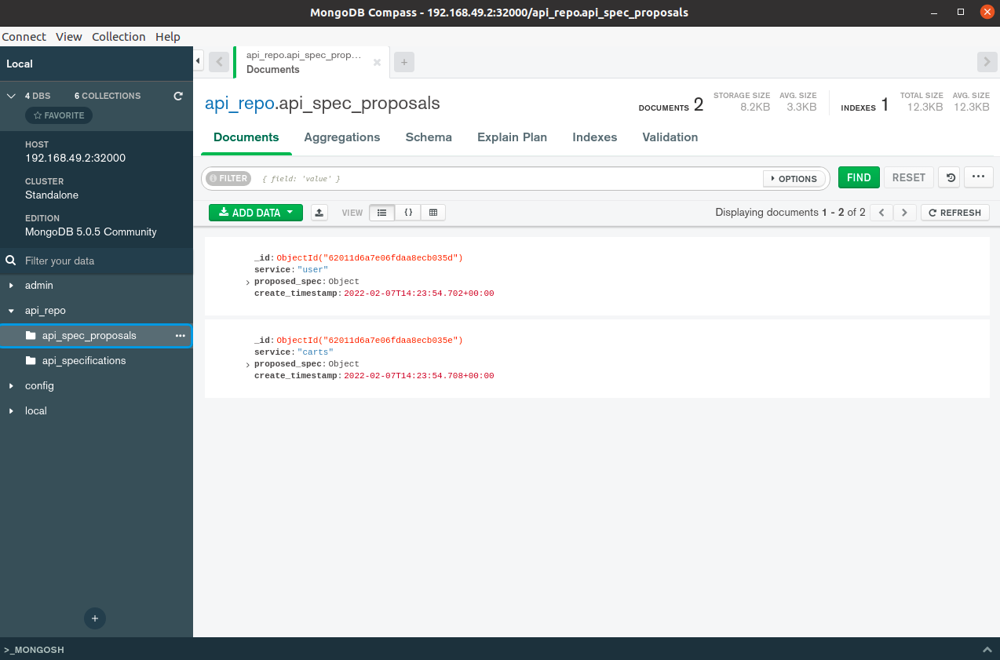
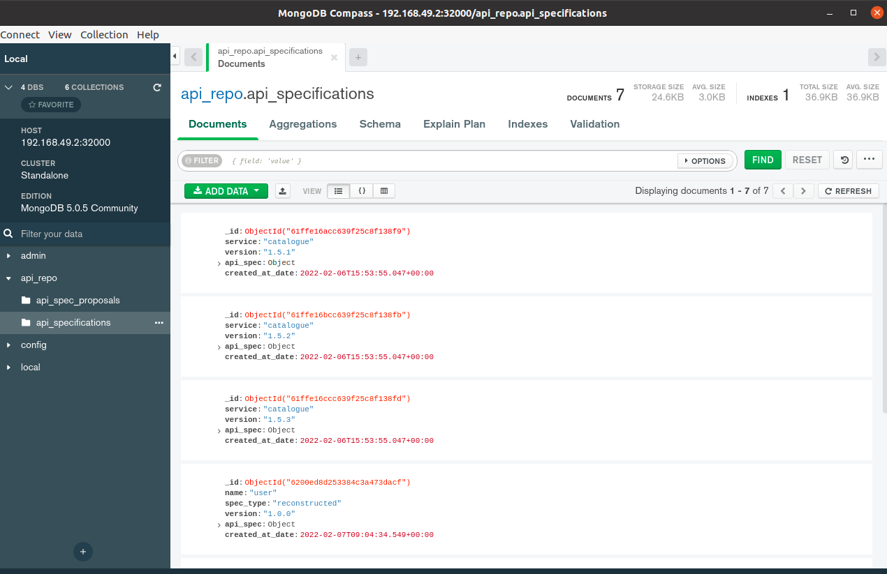

# TAPIRA: GDPR compliance Tool for **T**ransparent **API**s in **R**ESTful **A**rchitectures

This project serves as a proof of concept for our envisioned evolutionary API Repository in TAPIRA.
It consists of a small backend python application created with flask and a MongoDB database.

The APIRepo application requires that the postgresql database of APIClarity is accessible as a REST API through PostgREST.

The application exposes one REST endpoint `/update` which, if it gets triggered, pulls all reconstructed API specs from APIClarity, labels them with name, port, version and date and stores them in the mongoDB data inside the `api_specifications` collection.
A example API specification entry in the database can be found in the `sample_entry_api_repository.json` file.

# How to run

#### 1. Setup PostgREST

- https://www.notion.so/6d4e7f70bec14dfeba63360821a41ac8?v=0367dd24f9fe4b0e8b655e503a852bd8&p=4f88ec58ff554586afa06ab039888a7b

#### 2. Create MongoDB instace with docker-compose

```bash
docker-compose up -d
```

#### 3. Set up a virtual environment for python applications and install the project dependencies via the provided requirements.txt or Pipfile.

Install "pipenv" if not installed with the following command

```bash
  pip install pipenv
```

Change the current directory to the root directory of Tapira and then execute

```bash
  pipenv shell
```

This will spin up a virtual environment for you. After that execute the following:

```bash
  pipenv install
```

This will install all the dependencies for the backend project.
Inorder to install any other dependencies execute the following

```bash
  pipenv install <package-name>
  pipenv lock -r > requirements.txt
```
The above commands will install the required package, add it to the Pipfile and as well as add to the requirements.txt file.
#### 4. Entering and exiting the virtual environment.

In order to exit from the virtual environment either do ctrl+d or

```bash
  exit
```

in your command line. To spin up the virtual environment again execute
```bash
  pipenv shell
```
in the folder where Pipfile is located.

#### 5. If necessary, edit the credential variables, which can be found at the top in the first few lines of the `config.py` file. They are necessary to connect to the MongoDB, PostgREST and ApiDiff for a local setup.

```
APICLARITY_HOST = os.getenv("api_clarity_host", default="localhost")
APICLARITY_PORT = os.getenv("api_clarity_port", default=9998)
APICLARITY_URL = f'http://{APICLARITY_HOST}:{APICLARITY_PORT}'

APIDIFF_HOST = os.getenv("apidiff_host", default="localhost")
APIDIFF_PORT = os.getenv("apidiff_port", default=8080)
APIDIFF_URL = f'http://{APIDIFF_HOST}:{APIDIFF_PORT}'

mongodb_host = os.getenv("mongodb_host", default="192.168.49.2")
mongodb_port = os.getenv("mongodb_port", default=32000)
mongodb_user = os.getenv("MONGODB_USER", default="<<replace>>")
mongodb_password = os.getenv("MONGODB_PASSWORD", default="<<replace>>")
```

#### 6. Execute the following commands:

Execute the following to start the backend `flask run` in the folder where tapira.py is located.

#### 7. The application is now runinning under http://localhost:5000/

#### 8. Generate traffic in your application and review the API specifactions inside APIClarity to generate reconstructed API specifactions.

#### 9. If you now trigger http://localhost:5000/api/apiclarity_specs TAPIRA will fetch all reconstructed API specs and save them in the DB as Spec proposals. Only one spec proposal for a service is kept at a time.

#### 10. You can upload already existing specifications using the ``/api/upload`` endpoint. You can use this when you are sure your version of the OpenAPI spec is valid and complient and want to directly insert new version of an API specification.
##### 11. There is a Dockerfile, which is used to build the docker image.

##### 12. Here you can see two entries of the user API after 2 calls to the `/api/apiclarity_specs`.


##### 13. Here is an example of how a collection for api specifications can look like after a couple of uploads.

#### Deploy in Kubernetes:

    chmod +x deploy.sh
    ./deploy.sh
